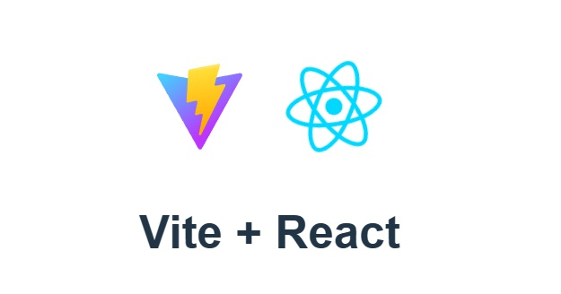

# Proyecto ElectroTools - DASHBOARD en REACT

Este proyecto responde al requerimiento del 8vo sprint del Proyecto Final del Curso de Digital House para el curso de Desarrollador Full Stack.

## Link a Proyecto Relacionado
Aquí está el proyecto que consume las APIs y hace las veces de tablero de administrador.

<a href="https://github.com/YoElDante/grupo_2_herramientasElectricas">
📁 https://github.com/YoElDante/grupo_2_herramientasElectricas
</a>

## APIs
Dejamos a mano las *url* de llamado a las APIs

<a href="http://localhost:3000/api/users">
👨‍💼 http://localhost:3000/api/users
</a>

<a href="http://localhost:3000/api/products">
📦 http://localhost:3000/api/products
</a>